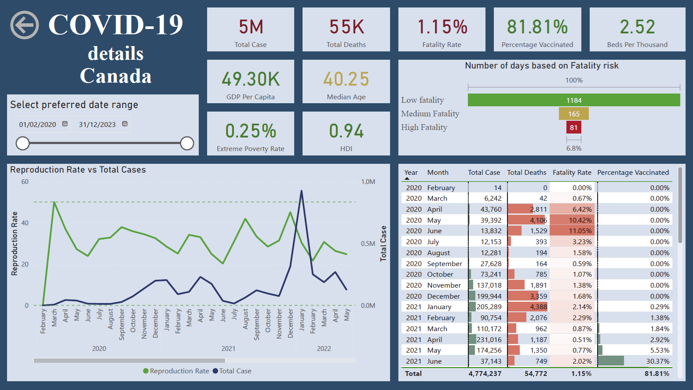

# 🦠 COVID-19 Global Impact Analysis

## Overview

This project investigates the global impact of COVID-19 using datasets containing country-level statistics on deaths, vaccinations, and development indicators. The analysis explores how factors like GDP per capita, Human Development Index (HDI), government policy (stringency index), and health infrastructure affected COVID-19 outcomes including total deaths, death rates, and vaccination coverage.

Data cleaning, transformation, and exploratory data analysis (EDA) were performed using **SQL** (https://github.com/movahed-abdolahi/COVID-19-Analysis-with-SQL) and visualized using **Power BI**. The goal was to uncover critical insights into the spread, severity, and control of the pandemic across the globe.

---

## Dataset Information

**Files Used:**

- `COVID-dataset.xlsx`: Combined and cleaned dataset containing case counts, deaths, vaccinations, and country-level socioeconomic data.
- `Date.xlsx`: Custom calendar table for time-based analysis in Power BI.
- Power BI Report:
  - `Covid-Analysis.pbix`: Final dashboard with KPIs, visuals, and filters.

---

## Creating date table

### Custom Date Table (DAX)

Used to support dynamic filtering and time intelligence in Power BI:

```DAX
Date = 
ADDCOLUMNS(
    CALENDAR(DATE(2019,1,1), DATE(2025,12,31)),
    "Year", YEAR([Date]),
    "Month", FORMAT([Date], "MMMM"),
    "MonthNumber", MONTH([Date]),
    "Quarter", "Q" & FORMAT([Date], "Q"),
    "Day", DAY([Date]),
    "Weekday", FORMAT([Date], "dddd"),
    "WeekdayNumber", WEEKDAY([Date], 2)
)
```

---

## Dashboard Overview (Power BI)

Key pages and features in the `.pbix` dashboard:

### 🌍 Global Overview
- Total cases, deaths, vaccinations
- Fatality and vaccination rates by continent
- Interactive map
- Drillthrough button to see detailed information when selecting a country on the map


### 📈 Country details page
- R-value vs case count over time
- Filterable by year and month
- Aggregated case/death/fatality rate by month and year
- Table visual with custom formattings showing case, death, fatality and percentage vaccinated for the selected country
- Country-level breakdown showing:
  - GDP, HDI, Median Age, Hospital Beds, Poverty Rate
  - Days segmented by fatality risk (low, medium, high)



---

## Key Insights

- Higher HDI and GDP didn’t always correlate with lower death rates.
- Government stringency impacted reproduction rate and case curves.
- Rolling vaccination analysis shows when countries ramped up efforts.
- Europe and Asia led in case and death counts, but also had high vaccination rates.

---

## Conclusion

This project demonstrates how real-world data analysis can uncover meaningful insights from global crises. Using SQL for data prep and Power BI for storytelling, we built a multi-dimensional view of COVID-19’s impact, influenced by economic, healthcare, and policy factors. The combination of structured query logic and compelling visuals brings clarity to complex global events.

---

## Files

- 📊 `COVID-dataset.xlsx`
- 📅 `Date.xlsx`
- 📊 `Covid-Analysis.pbix`

---

## License

This project is licensed under the MIT License. See the [LICENSE](LICENSE) file for more details.

---

## Author

**Movahed Abdolahi**  
🎓 Data & BI Analyst | Power BI  | SQL | Python  
🔗 [LinkedIn Profile](https://www.linkedin.com/in/movahed-abdolahi/)
